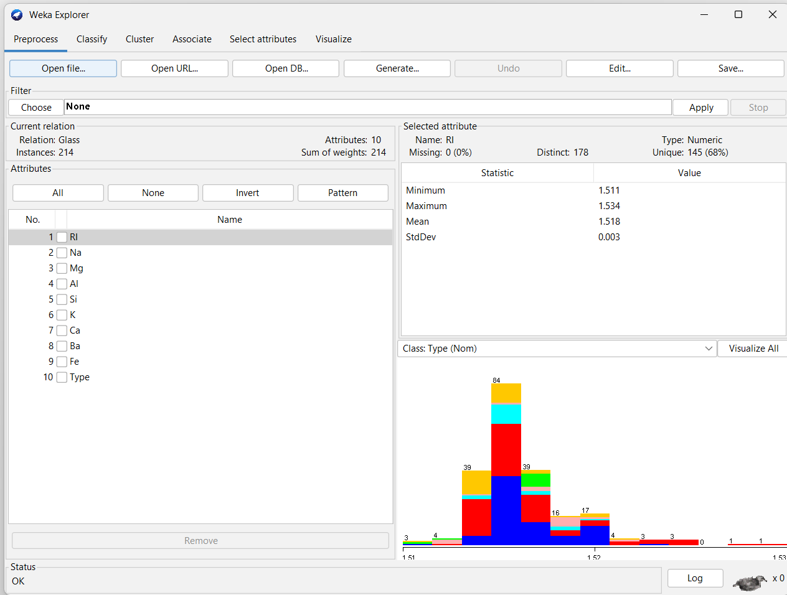
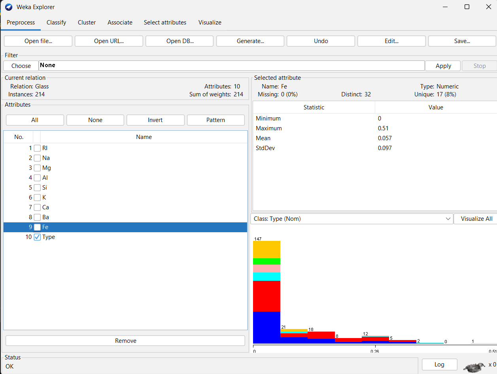
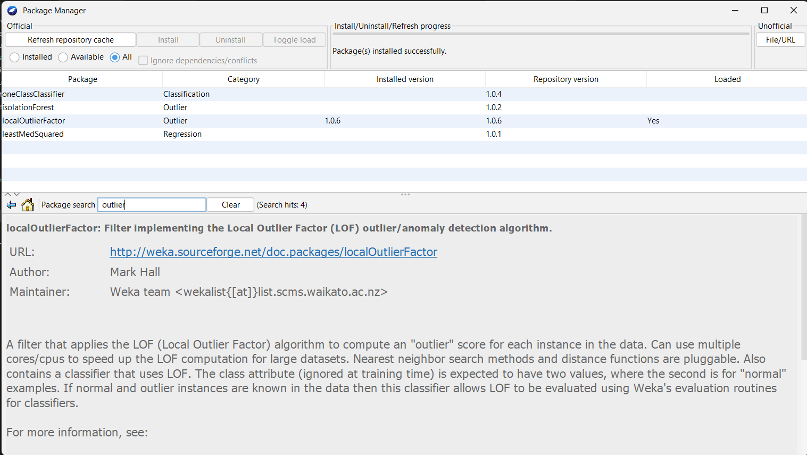

# GPT --> [convo](https://chatgpt.com/share/6809e49d-1f44-800c-8bef-5c3591ec51a2)

# python --> [code](./p8.py)

# minitab - doen't support density based outliers detection

# weka --> unable to find the OutlierDetection(include Knn and LoF) package in weka, on hold

<!-- ### 📦 Inbuilt Dataset: **"Glass.arff"**
- **Description**:
  - 214 instances
  - 9 numeric attributes related to the chemical composition of glass
  - A good dataset for detecting outliers in multivariate numerical data (some glass types might be rare outliers).

---

### 🧠 Steps to Use **"Glass.arff"** Dataset for Outlier Detection

---

### STEP 1️⃣: Load "Glass" Dataset

1. Open WEKA GUI Chooser.
2. Click Explorer.
3. Go to **File → Open file**.
4. Navigate to the directory containing the `glass.arff` file:  
   `C:\Program Files\Weka-3-9\data\glass.arff` (on Windows)  
   or `/Applications/weka-3-9/data/glass.arff` (on Mac)
   
5. Open it.

---

### STEP 2️⃣: Preprocess the Data

- Remove the **"Type"** attribute (the class label) since it's not needed for outlier detection.
  - In the "Preprocess" tab → Select the "Type" column → Click Remove.

---

### STEP 3️⃣: Distance-Based Outlier Detection (Using KNN)

1. In the "Preprocess" tab → Filter → Choose:
   ```
   unsupervised → attribute → KNNAnomalyDetector
   ```
2. Set **k = 10** (or experiment with other values).
3. Click **Apply** to apply the filter.
4. A new column "anomalyScore" will appear.
   
   ➡️ Higher anomaly scores indicate potential outliers.

---

### STEP 4️⃣: Density-Based Outlier Detection (Using LOF)

1. In the "Preprocess" tab → Filter → Choose:
   ```
   unsupervised → attribute → LOF
   ```
2. Set **k = 10** (or experiment with other values).
3. Click **Apply** to apply the filter.
4. A new column "LOF" will appear.
   
   ➡️ Values greater than 1.0 in the "LOF" column suggest outliers, with higher values indicating stronger outliers.

---

### STEP 5️⃣: Visualize Outliers

1. Go to the "Visualize" tab.
2. Select the **LOF** or **anomalyScore** as the Y-axis.
3. Select any other numeric attribute for the X-axis (e.g., "Refractive Index").
4. Look for points that are far from the main cluster; these are potential outliers.

---

### STEP 6️⃣: Save Your Results

1. Once you're done analyzing, you can save your dataset with outlier scores.
2. **File → Save** to export the dataset with the added anomaly scores or LOF values.

---

### 🔍 Example Use Case:
- **Outliers in glass types**: Certain types of glass (with unusual chemical compositions) may show high anomaly scores or LOF values, making them easy to spot.

---

### 📦 Other Datasets You Can Use:
- **Wine.arff**: 178 samples of wine with 13 features (e.g., alcohol content, color intensity) — useful for identifying anomalies in wine characteristics.
- **Iris.arff**: A classic dataset with 150 samples and 4 features (for flower classification, but can also be used for anomaly detection).
- **Diabetes.arff**: Data about diabetes (Pima Indians dataset) — good for detecting anomalies in health-related metrics. -->
