# GPT --> [convo](https://chatgpt.com/share/6809d472-0694-800c-903e-c9549f54231e)

# dataset --> iris from sklearn

# Steps

1. Importing the dataset  
2. Running Z-test  
3. Running t-test (2-sample)  
4. Running ANOVA (F-test)  
5. Running Chi-square test  

---

🌼 Step 1: Import the Iris Dataset into Minitab

1. Download the Iris dataset as CSV (e.g. from UCI: https://archive.ics.uci.edu/ml/machine-learning-databases/iris/iris.data) or export from sklearn
2. Open Minitab → File → Open → Browse to your CSV file.
3. Ensure columns are named:
   - SepalLength, SepalWidth, PetalLength, PetalWidth, Species
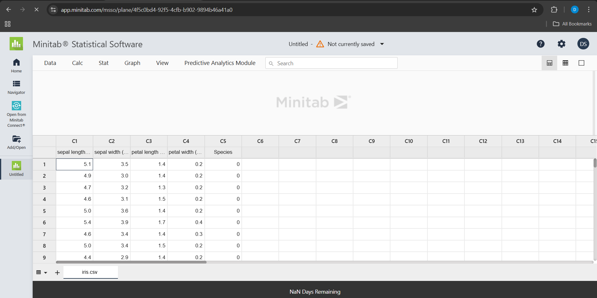
---


🧠 What is inferential statistics?  
Inferential stats help you make conclusions about a population based on a sample of data. You use tests like Z-test, t-test, ANOVA, and Chi-square to do that.

---

🔹 Step 1: Decide the dataset and columns to use

Let’s say you’ve loaded the Iris dataset into Minitab. You’ll see columns like:

- SepalLength
- SepalWidth
- PetalLength
- PetalWidth
- Species

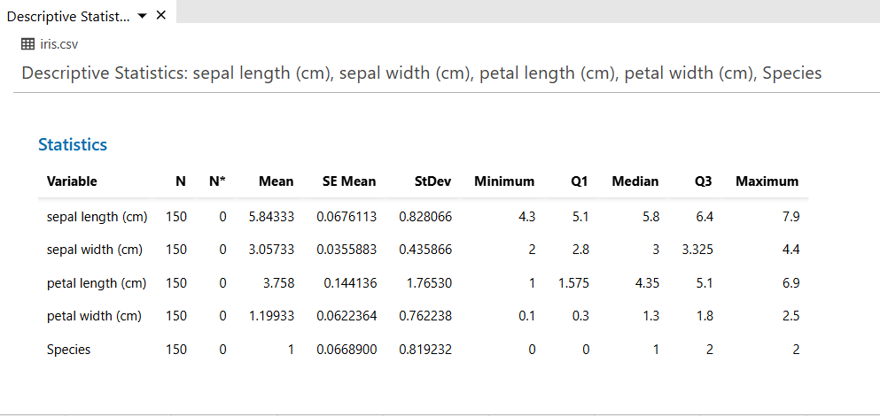
---

🔹 Step 2: One-Sample Z-Test

🧪 What does it do?  
Tests if the sample mean is significantly different from a known or claimed population mean.

📌 Example Question:  
"Is the average Sepal Length in this sample different from 5.8 cm?"

❓ Why 5.8?  
You can:
- Use a textbook value (if known from population studies), or
- Calculate it from your own data using:
  - Stat → Basic Statistics → Display Descriptive Statistics → select SepalLength  
  - Look at the “Mean” value — use that if no other reference exists

🛠 Steps in Minitab:

1. Menu: Stat → Basic Statistics → 1-Sample Z
2. “Samples in columns”: choose SepalLength
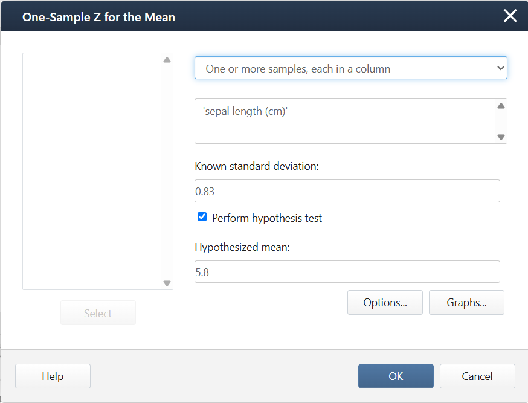
3. Check “Perform hypothesis test”
4. Type 5.8 into “Hypothesized mean”
5. Type standard deviation (e.g. 0.83, or calculate it using Stat → Basic Stats → Display Descriptive Stats)
6. Click OK

📊 Output: Z-value, p-value, and confidence interval.  
If p < 0.05 → statistically significant difference from 5.8

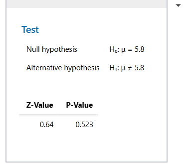
—

🔹 Step 3: Two-Sample t-Test

🧪 What does it do?  
Compares the mean of a numeric variable between two different groups.

📌 Example Question:  
"Do Setosa and Versicolor have different average Petal Length?"

🛠 Steps:
🎯 Goal: Compare the PetalLength between two species — let's say 0 and 1.

---

🔹 Step 1: Create a Subset Worksheet for Species 0 and 1 only

1. Go to the top menu: Data → Subset Worksheet  
2. Choose the option: Use rows that match condition  
3. In the condition box, type:

   ```
   Species = 0 or Species = 1
   ```

4. Click OK  
➡️ A new worksheet will open with only rows where Species is 0 or 1

---

🔹 Step 2: Run the 2-Sample t-Test

1. Go to: Stat → Basic Statistics → 2-Sample t  
2. In the dialog box:
   - Choose Samples in one column
   - For “Samples”: select the PetalLength column
   - For “Sample IDs”: select the Species column (now containing only 0 and 1)
   - You can leave “Assume equal variances” unchecked (safer unless you've tested for it)
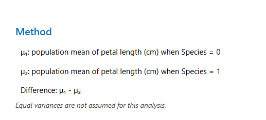

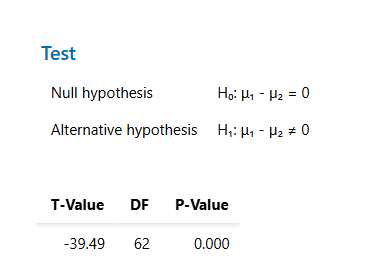
3. Click OK

---

📊 Result:
Minitab will show:
- Mean PetalLength for species 0 and 1
- t-value
- p-value  
If the p-value is less than 0.05, the difference is statistically significant.

Let's break down how to interpret the results of your **2-sample t-test** in Minitab:

### Given:
- **t-value** = -39
- **p-value** = 0
- **Degrees of Freedom (DF)** = 62

---

### **What is the t-value?**
- The **t-value** measures the size of the difference between the sample means relative to the variation in the sample data.
  - A **large absolute t-value** indicates a **large difference** between the sample means.
  - Since your t-value is **-39**, this is a **very large** negative value, suggesting a **strong difference** between the two groups (Species 0 and Species 1 in this case).

### **What is the p-value?**
- The **p-value** tells you the probability that the difference between the two sample means occurred by chance.
  - A **p-value < 0.05** indicates that the difference is **statistically significant**, meaning the result is unlikely due to random chance.
  - Here, your **p-value is 0**, which is **extremely small**, suggesting a **very strong statistical significance**.
  - In fact, a p-value of 0 is often rounded by software like Minitab when it’s very close to zero but not exactly 0.

### **What is the Degrees of Freedom (DF)?**
- **DF** is the number of independent values that are free to vary when calculating statistical parameters.
  - In the t-test, **DF = 62** suggests that the two groups you're comparing have enough data points to make a reliable statistical test.

### **Interpretation:**
- With **t = -39**, **p = 0**, and **DF = 62**:
  - The difference between the two species' **Petal Length** is **highly significant**.
  - This means there is a **strong statistical difference** between the means of Species 0 and Species 1. In other words, the **Petal Lengths** of Species 0 and 1 are **not the same**.
  - Since the **p-value is 0**, you can confidently reject the null hypothesis, which would typically state that the two means are equal.

---

### **Conclusion:**
There is overwhelming evidence to suggest that **Species 0 and Species 1 have significantly different Petal Lengths**. The difference is so large that the chance of it being due to random variation is essentially zero.

—

🔹 Step 4: One-Way ANOVA (F-Test)

🧪 What does it do?  
Checks if there’s a significant difference in means across 3 or more groups.

📌 Example Question:  
"Is Petal Width the same across all species?"

🛠 Steps:

1. Stat → ANOVA → One-Way

2. “Response”: PetalWidth
3. “Factor”: Species
4. Click OK

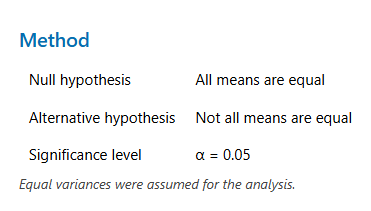
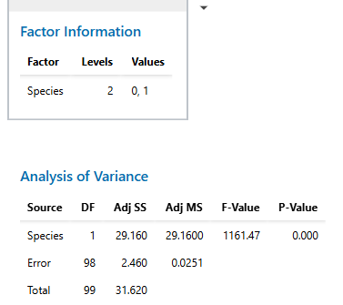


### **ANOVA Results Overview**:

| Source    | DF  | Adj SS | Adj MS | F-Value | P-Value |
|-----------|-----|--------|--------|---------|---------|
| Species   | 1   | 29.160 | 29.160 | 1161.47 | 0.000   |
| Error     | 98  | 2.460  | 0.0251 |         |         |
| Total     | 99  | 31.620 |        |         |         |

---

### **Simple Interpretation**:

1. **Species (Between Groups)**:
   - **DF (Degrees of Freedom) = 1**: You are comparing 2 groups (because 3 species minus 1 gives 1 DF).
   - **Adj SS (Adjusted Sum of Squares) = 29.160**: This shows the total variation in Petal Width explained by the differences between species.
   - **Adj MS (Mean Square) = 29.160**: This is the average variation between the species' means.
   - **F-Value = 1161.47**: This is a very large value, indicating that the differences between the species' means are much larger than the variation within each group.
   - **P-Value = 0.000**: This is the key result. The p-value is extremely small (essentially 0), meaning there is **strong evidence** to say that the **species have significantly different means** in terms of Petal Width.

2. **Error (Within Groups)**:
   - **DF = 98**: This is the remaining variation that’s not explained by the species. It represents the variability within each species group.
   - **Adj SS = 2.460**: The variation within the species is much smaller than the variation between species.
   - **Adj MS = 0.0251**: This is the average variation within each species.

3. **Total**:
   - **DF = 99**: Total degrees of freedom, which is the number of observations minus 1.
   - **Adj SS = 31.620**: The total variation in the data (including both between-group and within-group).

---

### **Layman's Summary**:
- The **p-value = 0.000** tells us that the difference in Petal Width between the species is **highly significant** — the difference is **not random**.
- **F-Value = 1161.47** is extremely large, reinforcing that the variation **between species** is much greater than the variation **within each species**.
- Overall, we can confidently say that **species are significantly different** in terms of their **Petal Width**.

---

### **Conclusion**:
- **Yes, there is a significant difference in Petal Width between the species.** This means that Petal Width is a distinguishing feature across the species in your dataset.

—

Ah, I see! You're right—Minitab doesn't directly have a **Binning** tool under **Data → Binning** for chi-square testing. Let’s go through an updated approach for **bining** and conducting a **Chi-Square Test for Association** in Minitab, step-by-step.

### 🔹 **Step 5: Chi-Square Test for Association**

---

### **Objective:**
The **Chi-Square Goodness-of-Fit Test** is used when you want to test whether the distribution of a single categorical variable matches an expected distribution.

### **Steps for Chi-Square Goodness-of-Fit Test in Minitab**:

#### **1. Set Up the Hypotheses**:
- **Null Hypothesis (H₀)**: The observed distribution of the **Species** column follows the expected distribution.
- **Alternative Hypothesis (H₁)**: The observed distribution of the **Species** column does **not** follow the expected distribution.

You need to define your **expected distribution**. For example, if you expect each species to have an equal probability of occurring (i.e., 1/3 for each species), then you will use this as the expected distribution.

#### **2. Perform the Chi-Square Goodness-of-Fit Test**:
1. **Go to**: **Stat → Tables → Chi-Square Goodness-of-Fit Test**.
2. In the dialog box:
   - **"Variables"**: Select your **Species** column.
   - **"Expected counts"**: You will need to specify your expected counts. If you expect each species to have an equal probability, enter **1/3** for each category. You can also manually input expected counts based on your hypothesis (e.g., if you expect the distribution to be skewed, enter different values for each category).
   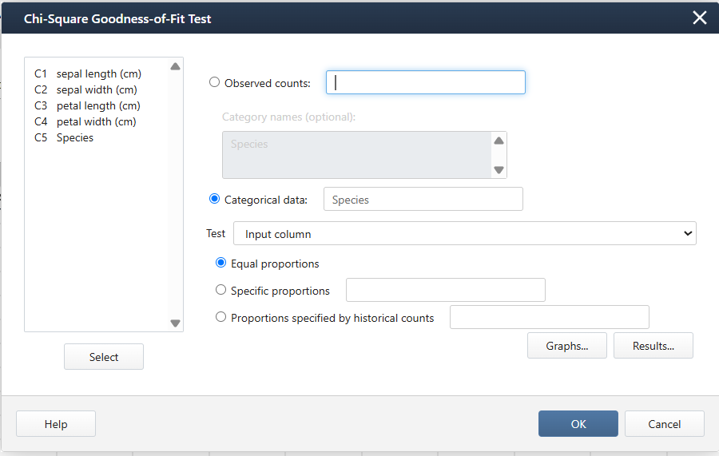
3. **Click OK**.

#### **3. Interpretation of Results**:
_Deleted some random values for proper results_
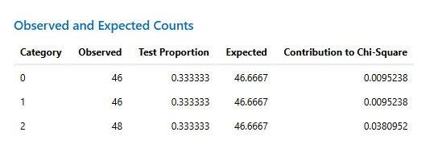
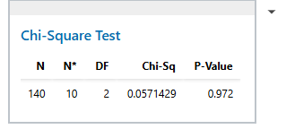

Sure! Here's a simple interpretation of your Chi-Square test results:

🔢 Output:

- N = 140 → You had 140 valid data points.
- N* = 10 → 10 data points were missing or excluded.
- DF = 2 → 3 categories – 1 = 2 degrees of freedom.
- Chi-Sq = 0.057 → Very small difference between observed and expected counts.
- P-Value = 0.972 → Very high.

📌 Interpretation (in plain words):

- ✅ The observed distribution of your categories is almost exactly what you expected.
- 🔍 The tiny Chi-Square value (0.057) means almost no difference between actual and expected values.
- 📈 The very high P-Value (0.972) means this difference is not statistically significant.

🟢 Conclusion:
You **fail to reject the null hypothesis** → the categorical data **follows the expected distribution**.  
👉 Your groups are likely **evenly distributed** (or at least match what you expected).
---

### **Example Scenario**:

Let’s say you want to test if the species in your dataset are equally distributed (i.e., 1/3 for each species).

1. **Observed**: You have counts for each species (e.g., 33 samples of species 0, 33 of species 1, and 34 of species 2).
2. **Expected**: Since you expect an equal distribution, your expected counts would be 33 for each species.

In the Chi-Square Goodness-of-Fit Test, you would input **33** as the expected count for each species.

---

### **Summary**:
1. Use **Chi-Square Goodness-of-Fit Test** when you have a **single categorical variable** (e.g., **Species**) and want to test how well it matches an expected distribution.
2. In **Minitab**: **Stat → Tables → Chi-Square Goodness-of-Fit Test** and input your **observed counts** and **expected counts**.
3. Interpret the **p-value** to decide whether your data fits the expected distribution.
