# GPT Convo --> [convo](https://chatgpt.com/share/6808f1d2-7c5c-800c-9772-e629ea780c6a)

# Python code --> [python file](./p9.py) - useless, too big. tool is better here

# minitab --> steps

### **Step-by-Step Guide for Time Series Forecasting in Minitab**

#### 1. **Import Your Data**
   - Open Minitab.
   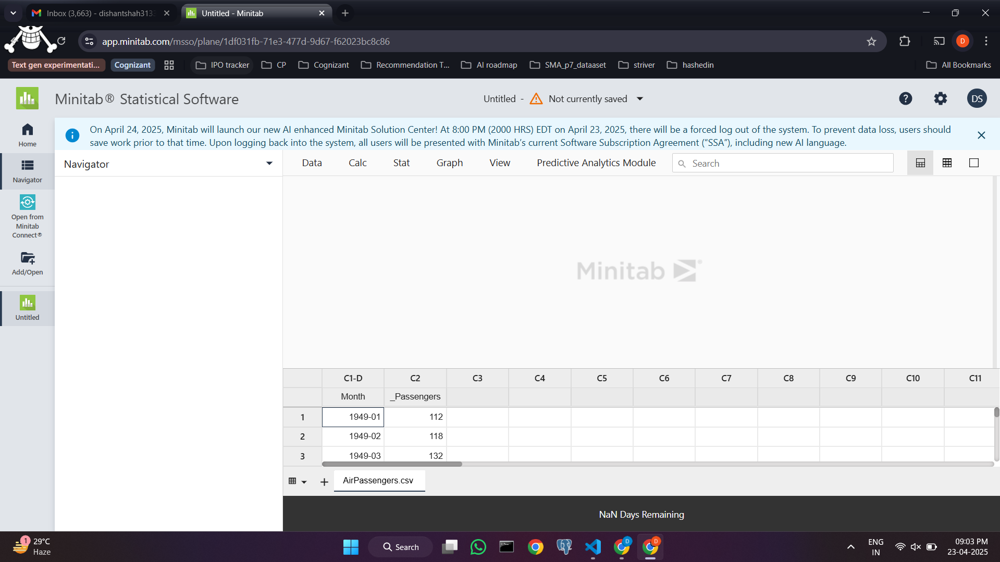
   - **File > Open**: Select your data file (e.g., Excel, CSV) containing time series data.
   - Make sure your data has a **time column** and a **value column**. For time series analysis, the time column should typically be in a date format (e.g., year/month or day).

#### 2. **Prepare Your Data**
   - **Date Format**: Ensure that the time column is in the correct **date or time format** (e.g., YYYY-MM or YYYY). If necessary, you can adjust this by using the **Data > Date/Time** menu.
   - **Column Arrangement**: Place the **Time** variable (e.g., dates or months) in one column and the **Value** (the variable you want to forecast) in another.

#### 3. **Create a Time Series Plot**
   - **Graph > Time Series Plot**: This is a helpful step to visualize the trends, seasonality, and any irregular components in your data.
   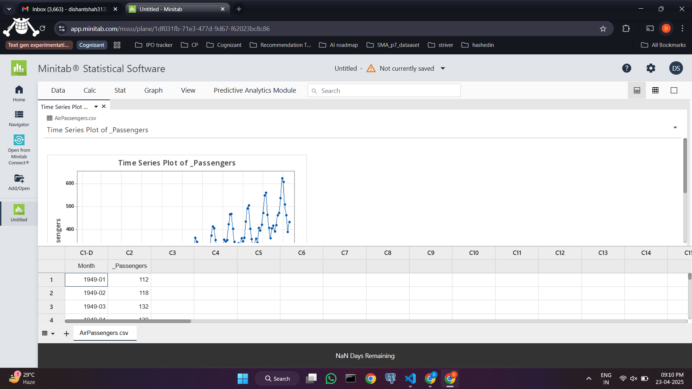
   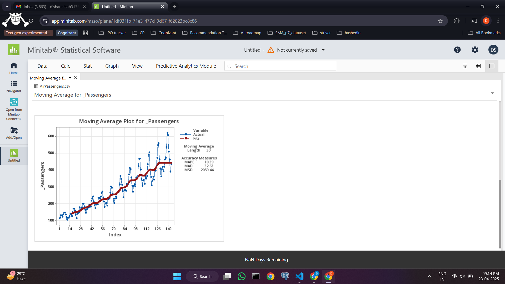
   - Select the **Value** column as the variable to plot.
   - Choose the time variable (e.g., month or year) as the **time scale**.

### 🔹 **3. Apply Forecasting Models**

---

#### 📌 A. **Exponential Smoothing**
1. Go to **Stat > Time Series > Exponential Smoothing**.
2. Select your data column.
3. Choose the method:
   - **Simple** – for stable data.
   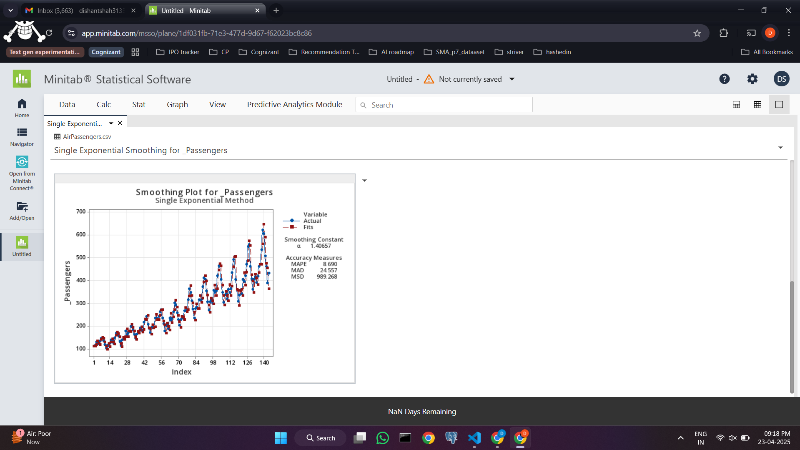
   - **Double** – for trending data.
   - **Triple** – for trend + seasonal data.
4. Click **Storage** to store the forecasts if needed.
5. Click **OK**.

---

#### 📌 B. **ARIMA**
1. Go to **Stat > Time Series > forecast with best ARIMA**.
2. Select your data column.
3. Use **forecast with best ARIMA** settings:
   
   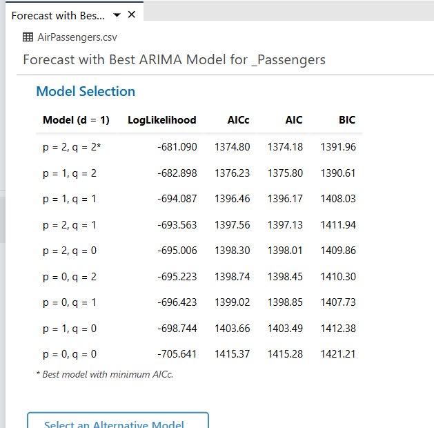
   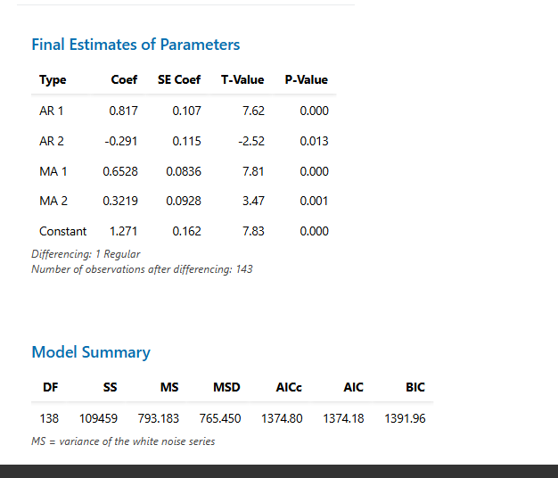
   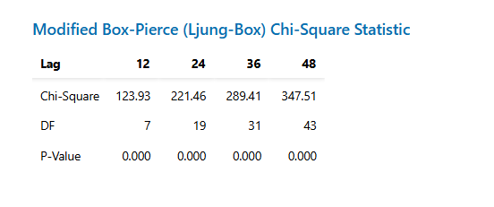
   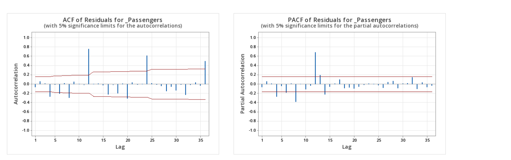
   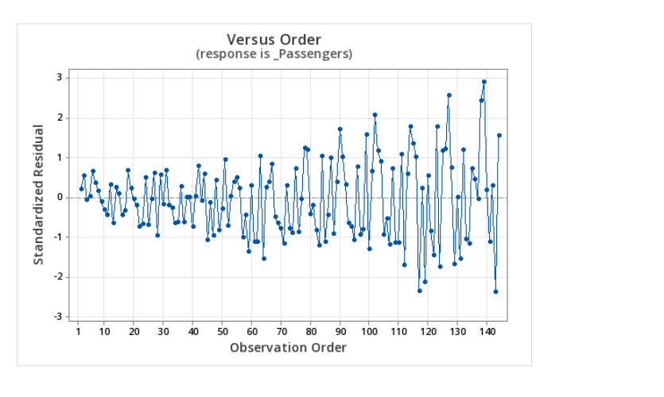
   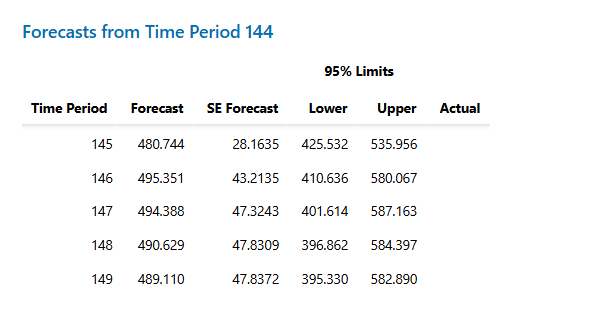
   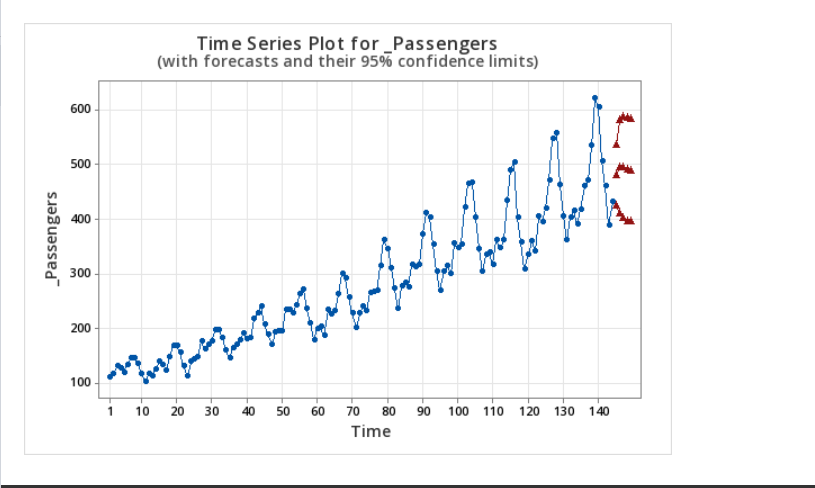
4. Click **OK**.

---

### 🔹 **4. View Forecast Results**
- Minitab will show:
  - Forecast values for future time periods.
  - **Prediction intervals** (e.g., 95% confidence).
  - Diagnostic plots: residuals, autocorrelation, etc.

---

### 🔹 **5. Compare the Models**
- Check **Residual Plots**:
  - Residuals should be randomly scattered (no pattern).
- Check **Goodness-of-fit stats** in the session window:
  - **MAPE**, **MAD**, **MSD** – lower is better.
- Choose the model with:
  - Lower forecast error.
  - Better residual behavior.

---

### 🔹 **6. Plot the Forecast**
- Go to **Graph > Time Series Plot** again.
- Add actual data and forecasted data together.
- Helps to visually compare forecast vs actual.

---

### ✅ **Conclusion**
- Use **Exponential Smoothing** for quick, automatic forecasting.
- Use **ARIMA** if your data has trends or seasonality and you want a more flexible model.
- Minitab shows all results clearly — just compare errors and plots to choose the better model.